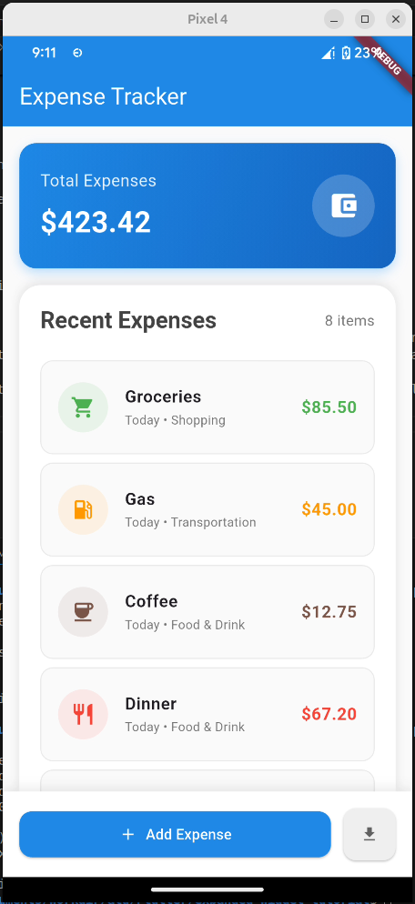

# Expanded Widget Tutorial

A Flutter app demonstrating the practical usage of the Expanded widget in creating responsive layouts for an expense tracking interface.

## Screenshots



## How to Run

1. **Clone the repository**
   ```bash
   git clone git@github.com:Mugisha-isaac/Flutter-expanded-widget.git
   cd expanded_widget_tutorial
   ```

2. **Install dependencies**
   ```bash
   flutter pub get
   ```

3. **Run the app**
   ```bash
   flutter run
   ```

## Expanded Widget Key Attributes

The `Expanded` widget is essential for creating flexible layouts in Flutter. Here are its three key attributes:

### 1. **child** (required)
The widget that will be expanded to fill the available space. In this app, we use `Expanded` to wrap various UI components like the expense list and buttons.

### 2. **flex** (optional, default: 1)
Determines how much space the widget should occupy relative to other `Expanded` widgets. In our expense tracker:
- The total amount section uses `flex: 2` (takes 2/3 of available width)
- The add expense button uses `flex: 2` (takes more space than the export button)

### 3. **key** (optional)
A unique identifier for the widget, useful for maintaining state and testing purposes.

## Features

- **Responsive Layout**: Uses `Expanded` widget to create flexible layouts that adapt to different screen sizes
- **Expense Tracking**: Displays a list of expenses with categories, amounts, and icons
- **Material Design**: Modern UI following Material Design principles
- **Scrollable Interface**: Expense list scrolls independently while maintaining fixed header and footer

## Project Structure

```
lib/
├── main.dart           # Main application entry point
└── model/
    └── Expense.dart    # Expense data model
```

## Key Implementation Details

The app demonstrates three main uses of the `Expanded` widget:

1. **Main Content Area**: The expense list uses `Expanded` to take up all remaining vertical space
2. **Horizontal Layout**: The summary card uses `Expanded` with `flex: 2` for responsive width distribution
3. **Button Layout**: The bottom action buttons use `Expanded` to create proportional spacing

This project serves as a practical example of how `Expanded` widgets solve real-world layout challenges in Flutter applications.
